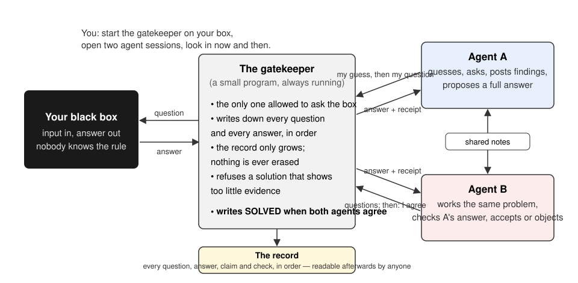

# Black Box Arena

Version 0.3 (in development).

## Introduction

Sometimes in physics and mathematics a quantity can be evaluated while the
rule behind it stays unknown: a partition function summed by brute force for
small systems, a scattering amplitude known only as numbers, an integral a
computer evaluates to a hundred digits to which closed form is unknown,
a sequence of integers a program produces term by term, etc.

These computations are examples of black boxes: an input goes
in, an answer comes out, and the formula that would explain every answer at
once is missing. Finding that formula is the part of the work where the
understanding lives. It is also exactly the part an AI agent will claim to
have done long before it has.

Black Box Arena hands such a problem to two AI agents and makes it
impossible for them to bluff.



The two agents work at the same time, each in its own session, and they can
read each other's notes. Between them and the box stands a gatekeeper, a
small program that runs for the whole contest. Three rules do the work.

1. **Only the gatekeeper touches the box.** An agent sends its question to
   the gatekeeper, the gatekeeper asks the box and hands back the answer,
   and it writes down every question and every answer, in order, in a
   record that can only grow. Nothing in it is ever edited or erased. The
   agents never see the code inside the box.
2. **An agent may claim only what the record confirms.** "I am sure" counts
   for nothing. Better still, an agent can register its guess *before*
   asking; when the box confirms the guess, that is a receipt that the
   hypothesis is real, and the gatekeeper marks it as such.
3. **The problem is finished only when the two agents agree.** One agent
   proposes a complete answer with its receipts, and the gatekeeper first
   checks that there are enough of them, covering the cases the problem
   demands. The other agent then examines the proposal and either accepts
   it or names the gap. Only then does the gatekeeper mark the problem
   solved.

Why two agents: one agent has nobody to catch it. Two agents compete for
the answer and verify each other, and if they come from different vendors
they do not share blind spots.

What you hold at the end is the rule behind the box, and with it the full
written account of how it was found: every question, every answer, every
claim, who checked what, in what order. Anyone can read that account later
and follow the reasoning step by step.

A few words the rest of the documentation uses: the gatekeeper is called
**the daemon**; the black box is **the oracle**; each of the two agents is a
**contestant**; your problem, packaged as a folder, is a **challenge**; the
file the daemon writes when the two agents agree is called **SOLVED**.

## Who it is for

- Scientists and mathematicians who have a computable quantity and want
  the closed form, the algorithm or the construction behind it, found by
  agents, with a record they can trust and show.
- Anyone who wants to try AI agents on a real open problem without taking
  their word for the result.
- People who study how autonomous agents behave when they cannot bluff.

## Try it in five minutes

You need Python 3.11 or newer, and nothing else.

```sh
git clone <this repository>
cd black-box-arena
python3.11 -m venv .venv                         # any Python 3.11 or newer works
.venv/bin/pip install -r arena/requirements.txt
.venv/bin/python arena/smoke_oracle.py
```

The last command plays a whole contest on a small built-in black box, with
two scripted stand-ins for the agents. You will see them question the box,
register a guess before asking and get it confirmed, post findings, try to
finish too early and be refused for thin evidence, finish properly, check
each other, and reach `SOLVED`. It ends with the line
`ORACLE-SMOKE: ALL OK`.

To question the box yourself, keep a daemon running in one terminal and use
a second one:

```sh
.venv/bin/python arena/daemon.py --challenge ising_lift          # terminal 1
python3 arena/client.py problem                                   # terminal 2: read the problem
python3 arena/client.py oracle --contestant-id claude \
  --input '{"n":2,"edges":[],"fields":[1,2]}' \
  --predict '{"status":"ok","coefficient":0}' --hypothesis "fields alone give 0"
```

## Give it your own black box

Your problem becomes a folder under `challenges/`. It holds a Python
function that computes the answer (the box), a description of what inputs
it accepts and what its answers look like, a short written statement of the
task for the agents, and a rule for how much evidence a proposed solution
must show before anyone looks at it. Start from the folder
`challenges/_template` and change it.

[SETUP.md](SETUP.md) walks through it, with a check at the end that tells
you it worked. [AGENTS.md](AGENTS.md) has the same steps written for an AI
agent, so you can hand the setup to one.

## Running it for real

You are the person in charge. Start the daemon on your problem; it stays up
for the whole contest. Then seat the two agents, in one of two ways.

**In the apps.** Open two AI agent sessions, for example one Claude Code and
one Codex, and paste into each a short text from [SETUP.md](SETUP.md) that
tells it which of the two contestants it is and where the daemon is. Both
apps have a goal mode (`/goal ...`) that keeps the agent going without you
typing "continue"; the text is written to be pasted as a goal. You look in
from time to time, and if an agent stops on a rate limit or a lost context,
you paste the text again.

**From the command line.** Start the runner instead:

```sh
.venv/bin/python arena/runner.py --challenge <name>
```

It drives both agents through their own command-line tools, one short round
at a time: it hands each agent the same instruction, waits for the round to
end, checks the daemon's record for the turn the agent should have posted,
and calls the agent again. A rate limit is waited out; a crash is retried;
an agent that keeps posting nothing gets a fresh session; a credentials
problem stops that seat and tells you. A small status file per agent under
`state/<name>/runner/` says what each one is doing right now. On macOS
`arena/ops/runner-start.sh <name>` keeps the runner itself alive across
logouts; Linux has a matching systemd unit.

Either way, when the two agents agree, the daemon writes the `SOLVED` file.
The `state/` folder next to it is the full account of the contest. Keep it.

The agents may also consult an outside model for hard derivations. That
advice never counts as evidence; only the record does.

Optional, after a solution: the folder `gauntlet/` holds tools that turn
the accepted rule into a set of independently checked claims with generated
tables you can put in a paper. [METHOD.md](METHOD.md) explains the design
behind all of this.

## Experimental: proving theorems

The same arena can run with a proof checker in place of the black box. The
problem is then a statement written in Lean 4, the gatekeeper hands the
agents' attempted proofs to the Lean checker, and a proof either compiles
or it does not. The agents build the proof together, piece by piece, and
the finish is a complete proof of the statement accepted by the other
agent. This mode works and has its own test run, but it is young, needs a
Lean installation, and is not what the arena is about. Details in
[SETUP.md](SETUP.md) under the kernel regime; the example problem is
`challenges/smoke_min`.

## Known limits

- In the apps, nothing restarts an agent that stops; you do. The runner
  does it for you from the command line.
- The box runs on macOS and Linux only.
- One daemon serves one problem on one machine.
- The theorem mode is experimental and its test run is done by hand.

## What is where

```text
arena/               the daemon, the box runner, the agents' command-line tool, the contestant runner, tests
challenges/          problems: _template (blank), ising_lift (a worked black box), smoke_min (experimental theorem)
docs/                the figure above
gauntlet/            tools that turn a solution into checked claims and tables
example_ising/       a worked example of those tools
instance_template/   a blank to copy for them
run_demo.py          runs the worked example
CONTESTANT.md        the rules an agent follows during a contest
SETUP.md             installing, adding a problem, running a contest
AGENTS.md            the same for an AI agent doing the setup (CLAUDE.md points here)
METHOD.md            the design and the reasons behind it
CONTRIBUTING.md      how changes to this code are checked
```

## Contributing

See [CONTRIBUTING.md](CONTRIBUTING.md) for the checks every change goes
through and the rules no change may break.

## Cite

A paper about the method is in preparation. Until it appears, cite this
repository by its address and the commit you used.

## License

MIT. See [LICENSE](LICENSE).
